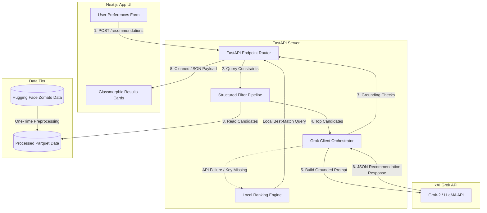

# 🍽️ AI-Powered Restaurant Recommendation System

An AI-driven restaurant discovery dashboard that blends structured query filtering with personalized natural language rankings. Backed by real **Zomato** data, it uses **Grok (xAI)** via an OpenAI-compatible API to generate grounded recommendations, hosted on a modern glassmorphic **Next.js** frontend with a high-performance **FastAPI** backend.

---

## 🚀 Key Features

* **Grounded AI Recommendations:** Recommendations are strictly anchored in real Zomato datasets to completely eliminate LLM hallucinations.
* **Structured Pre-LLM Filtering:** A high-speed pandas filtering pipeline runs first to trim down candidates before calling the LLM, reducing latency, token consumption, and cost.
* **xAI Grok Integration:** Employs Grok prompts to provide personalized, human-like reasoning and summaries for why each restaurant fits the user's specific mood/cravings.
* **Robust Local Fallback Engine:** If API quotas are exhausted or the xAI service is unreachable, the system automatically runs a structured sorting fallback to guarantee 100% uptime.
* **Premium Glassmorphic UI:** A sleek dark-mode user interface using Outfit typography, layout micro-animations, autocomplete comboboxes, and responsive grids.
* **Production-Ready Tests:** Complete unit and integration test suite asserting correctness on data ingestion, pipeline filters, Pydantic inputs, and prompt building.

---

## 🏗️ System Architecture & Data Flow



---

## 🛠️ Technology Stack

| Layer | Choice | Description |
| :--- | :--- | :--- |
| **LLM Orchestration** | **Grok (xAI API)** | Provides conversational recommendations using the OpenAI SDK client. |
| **Backend Framework** | **Python (FastAPI)** | Light-speed REST API for input validation, data filters, and service routing. |
| **Data Processing** | **Pandas & PyArrow** | Fast data parsing, cleaning, quantile-based budget bucketing, and Parquet storage. |
| **Frontend Framework** | **Next.js 15 (TypeScript)** | Server-side supported client dashboard using React components. |
| **Styling** | **Vanilla CSS** | Highly optimized dark mode theme incorporating glassmorphism gradients. |
| **Testing** | **Pytest** | Full unit testing, route mocking, and parsing check assertions. |

---

## 📂 Project Repository Layout

```
├── backend/
│   ├── src/
│   │   ├── api/              # FastAPI route controllers and response DTO schemas
│   │   ├── ingestion/        # Hugging Face ingestion and prep scripts
│   │   ├── data/             # Local Parquet loaders
│   │   ├── filters/          # Core pandas pre-LLM filtering pipeline
│   │   ├── llm/              # Grok client, custom prompt builders, and JSON parsers
│   │   ├── models/           # Pydantic user preference models
│   │   └── config.py         # App environment configuration variables
│   ├── tests/                # Unit test suites (health, preprocessing, recommendations)
│   ├── requirements.txt      # Python dependencies
│   ├── pytest.ini            # Pytest execution settings
│   └── .env.example          # Template for local backend env setup
├── frontend/
│   ├── app/                  # Next.js App Router layout and pages
│   ├── components/           # Reusable UI parts (Form, Cards, Summary, Status)
│   ├── lib/                  # API client fetch functions and TS type interfaces
│   ├── package.json          # Node dependencies and build scripts
│   └── .env.local.example    # Template for local frontend env setup
├── data/
│   └── processed/            # restaurants.parquet (generated cleaned output)
├── docs/                     # Comprehensive architecture and deployment guides
└── README.md                 # Project portfolio entry point
```

---

## ⚡ Quick Start & Installation

### 1. Prerequisites
* **Python 3.10+**
* **Node.js 18+** with `npm`

---

### 2. Backend Setup
Navigate to the `backend/` directory:
```powershell
cd backend
```

Create and activate a Python virtual environment:
```powershell
# Windows
python -m venv .venv
.\.venv\Scripts\Activate.ps1

# macOS/Linux
python3 -m venv .venv
source .venv/bin/activate
```

Install dependencies:
```powershell
pip install -r requirements.txt
```

Set up local configurations:
```powershell
copy .env.example .env
```
Open `.env` and fill in your keys:
```env
XAI_API_KEY=your-grok-api-key
GROK_MODEL=grok-2-latest
CORS_ORIGINS=http://localhost:3000
```

**Ingest & Preprocess the Zomato Dataset:**
Run the ingestion pipeline to pull the Zomato database from Hugging Face, clean records, map budget buckets, and output a local Parquet dataset file:
```powershell
# Ensure backend directory is in the PYTHONPATH
$env:PYTHONPATH = (Get-Location).Path

# Run the ingestion script
python -m src.ingestion.prepare_data
```
This generates `data/processed/restaurants.parquet` containing cleaned restaurant profiles.

**Run the API Server:**
```powershell
python -m uvicorn src.api.main:app --reload --host 0.0.0.0 --port 8000
```
Verify the server is running by opening: `http://localhost:8000/health`.

---

### 3. Frontend Setup
Navigate to the `frontend/` directory:
```powershell
cd ../frontend
```

Install packages:
```powershell
npm install
```

Configure local environment variables:
```powershell
copy .env.local.example .env.local
```
Ensure `.env.local` contains:
```env
NEXT_PUBLIC_API_URL=http://localhost:8000
```

Run the Next.js development server:
```powershell
npm run dev
```
Open [http://localhost:3000](http://localhost:3000) to view the recommendation dashboard.

---

### 4. Running Tests
Run the pytest suite to verify all backend logic (data cleansing, metadata filters, validation models, and mock LLM calls):
```powershell
cd ../backend
$env:PYTHONPATH = (Get-Location).Path
python -m pytest
```

---

## ⚙️ Environment Variables

### Backend Configuration (`backend/.env`)
| Variable | Default Value | Description |
| :--- | :--- | :--- |
| `XAI_API_KEY` | *(Required)* | Your xAI console API key. |
| `GROK_MODEL` | `grok-2-latest` | Model version for generating recommendations. |
| `CORS_ORIGINS` | `http://localhost:3000` | Allowed origin domains (comma-separated). |
| `DATA_PATH` | *(Automatic)* | Path to the Parquet dataset file. |

### Frontend Configuration (`frontend/.env.local`)
| Variable | Default Value | Description |
| :--- | :--- | :--- |
| `NEXT_PUBLIC_API_URL` | `http://localhost:8000` | URL endpoint for backend REST API. |

---

## 🌐 Production Deployment (Live Setup)

Follow these steps in order to host the application live on the web:

1. **Prepare GitHub Repository:**
   * Push your entire project codebase (containing both `backend` and `frontend` subdirectories) to a public GitHub repository.

2. **Deploy Backend API (on Render / Koyeb):**
   * Log in to **Render** (or Koyeb) using your GitHub account.
   * Create a new **Web Service** and connect it to your project repository.
   * Configure the service settings:
     * **Name:** `restaurant-recommender-api` (or a name of your choice)
     * **Root Directory:** `backend` (Points Render directly to your API source folder)
     * **Runtime / Language:** `Python 3`
     * **Build Command:** `pip install -r requirements.txt && python -m src.ingestion.prepare_data` *(Important: This installs requirements and downloads/processes the Zomato dataset to generate the Parquet file during build time)*
     * **Start Command:** `python -m uvicorn src.api.main:app --host 0.0.0.0 --port $PORT`
     * **Plan:** Select the **Free** tier
   * In **Advanced Settings**, add the following **Environment Variables**:
     * `XAI_API_KEY`: *(Your Grok API key)*
     * `GROK_MODEL`: `grok-2-latest`
     * `CORS_ORIGINS`: `https://your-frontend-app.vercel.app` *(You can update this placeholder after your frontend deployment is live)*
   * Click **Create Web Service**. Once deployed, copy the live API URL (e.g., `https://restaurant-recommender-api.onrender.com`).

3. **Deploy Frontend Client (on Vercel):**
   * Log in to **Vercel** using your GitHub account.
   * Click **Add New** -> **Project** and import your repository.
   * Configure the project settings:
     * **Framework Preset:** `Next.js`
     * **Root Directory:** `frontend` (Points Vercel directly to your Next.js application folder)
     * **Environment Variables:** Add `NEXT_PUBLIC_API_URL` and set its value to your live backend URL (e.g., `https://restaurant-recommender-api.onrender.com`).
   * Click **Deploy**. Vercel will compile the pages and launch the client site. Note down your live website domain (e.g., `https://your-app-name.vercel.app`).

4. **Update CORS Configuration:**
   * Go back to your **Render Web Service Dashboard** -> **Environment** tab.
   * Update the `CORS_ORIGINS` variable value to match your actual live frontend website URL (e.g., `https://your-app-name.vercel.app`).
   * Save the change. Render will automatically redeploy the backend with proper production access policies.

---

## 📈 Portfolio Summary: Key Product Decisions

1. **Hybrid Architecture (Pandas Filter + LLM Refinement):** Sending a raw dataset (50,000+ entries) directly to an LLM context is cost-prohibitive and slow. We implemented a pandas pre-filtering pipeline that instantly narrows candidates based on exact query inputs (location, budget, rating, cuisine), passing only a relevant candidate subset to the LLM.
2. **Grounding Validation Checks:** To prevent LLM hallucinations, the API intercepts the Grok JSON response, verifies that the recommended names match the records loaded from the dataset, and automatically injects exact ratings and costs directly from the verified database.
3. **Graceful Fallback Mode:** If API key limits are reached, the system will not crash. The backend gracefully shifts to a local search engine, generating structured recommendations with generic descriptions instantly.
