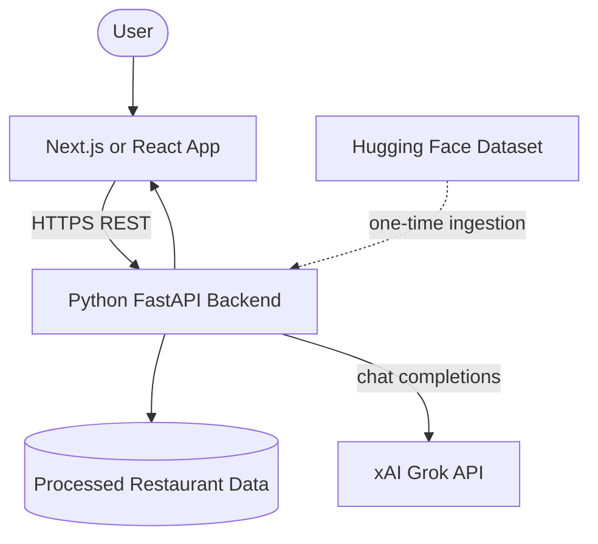
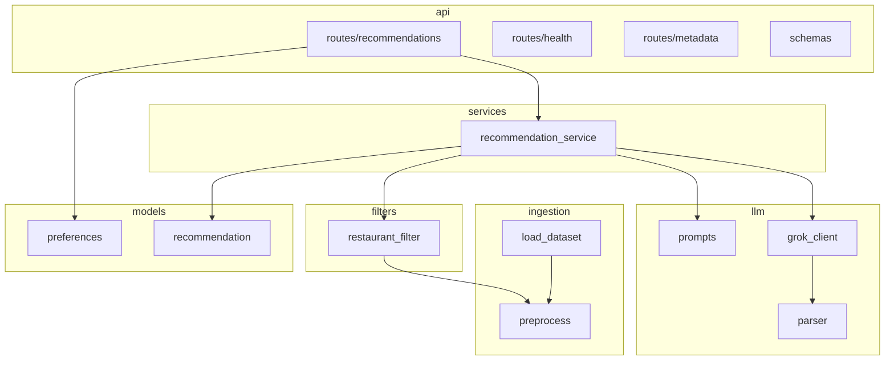
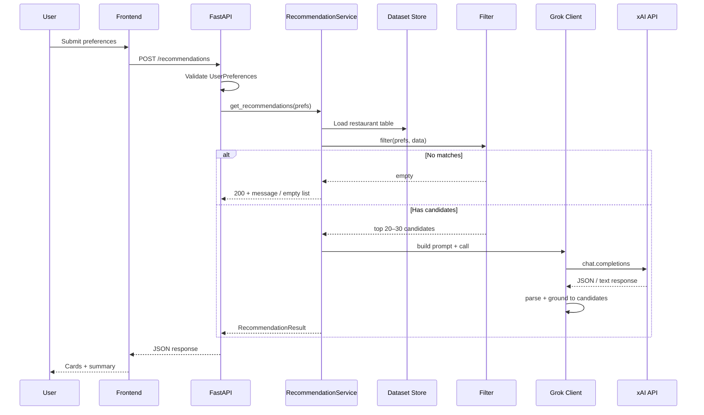
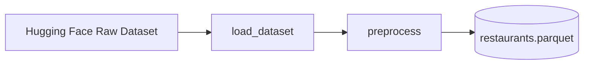
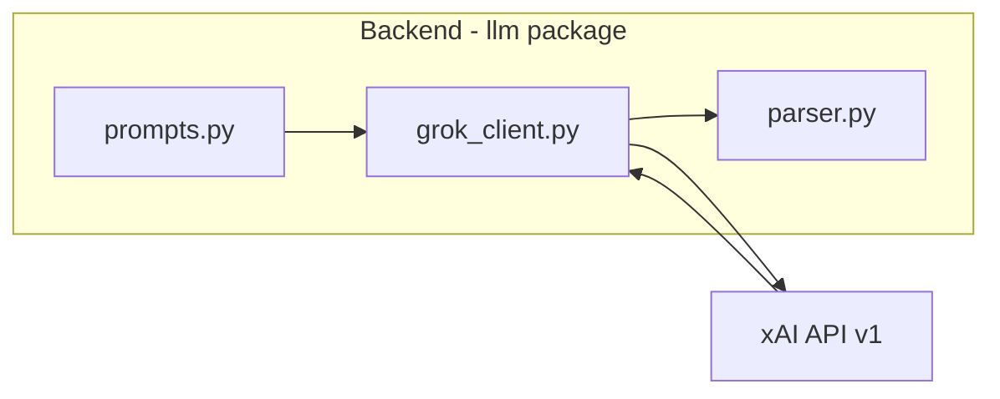
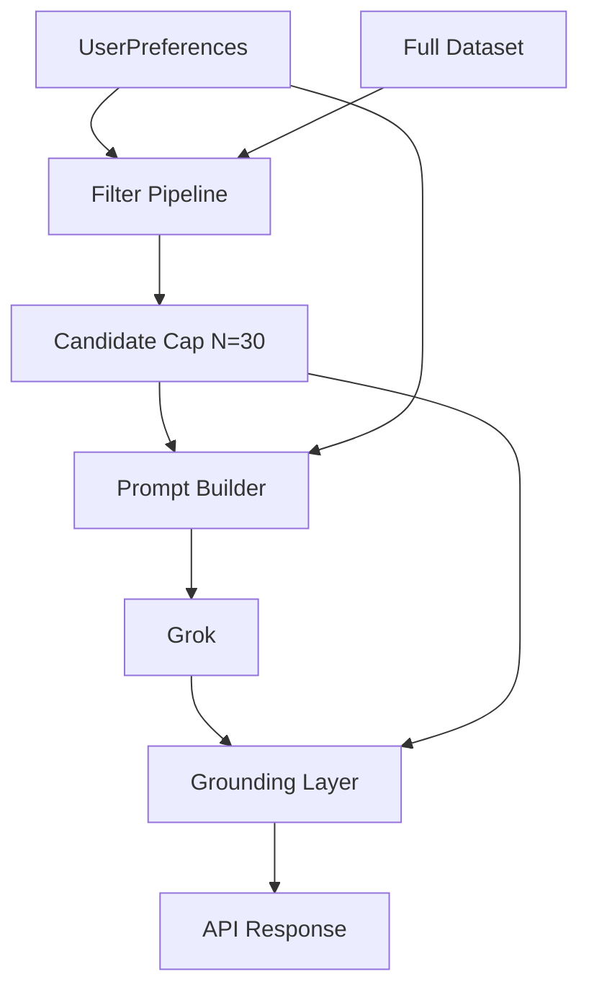
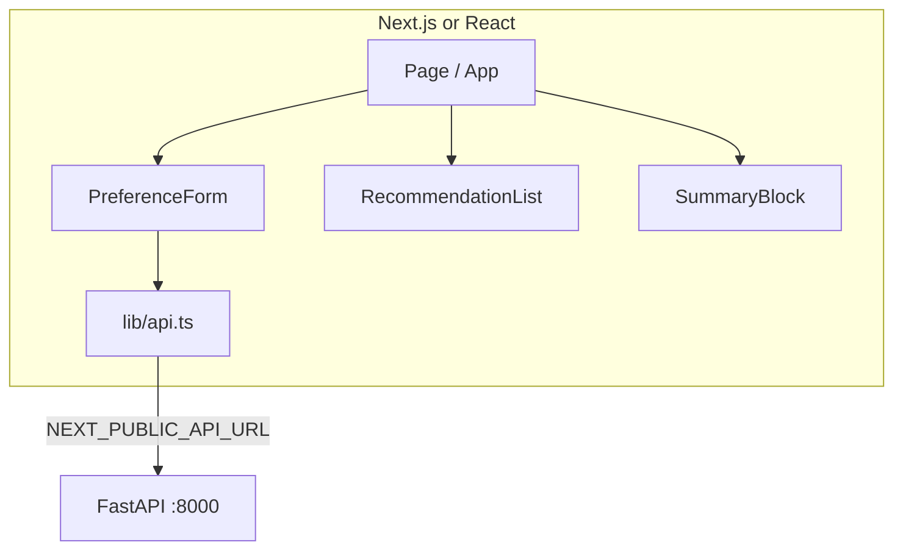
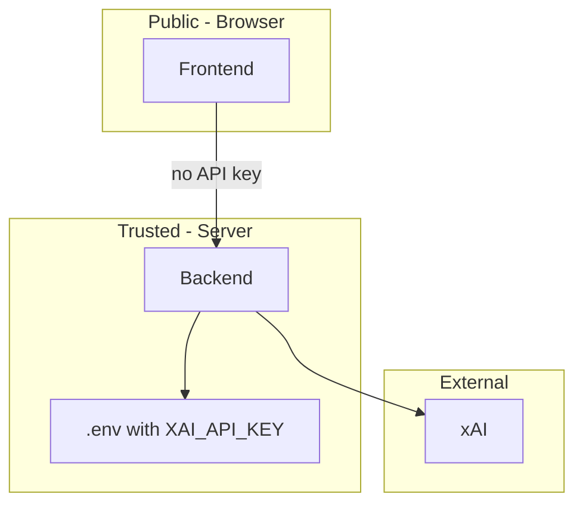

# System Architecture: AI-Powered Restaurant Recommendation System

This document describes the **target system architecture** for the Zomato-inspired recommendation service. It is derived from [implementation.md](./implementation.md) and [problem statement.md](./problem%20statement.md).

---

## 1. Purpose

The system combines **structured restaurant data** (Hugging Face Zomato dataset) with **Grok (xAI)** to produce grounded, personalized recommendations. Architecture separates concerns:

- **Frontend** — collect preferences and display results
- **Backend** — validate input, filter data, orchestrate Grok, enforce grounding
- **External AI** — ranking and natural-language explanations only on a bounded candidate set

---

## 2. Architecture Principles

| Principle | Description |
|-----------|-------------|
| **Filter before AI** | Location, budget, cuisine, and rating filters run in Python before any Grok call |
| **Grounded recommendations** | Grok may only recommend restaurants present in the filtered candidate list |
| **Secrets on server** | `XAI_API_KEY` lives only in the backend; the browser never calls xAI directly |
| **Thin client** | Frontend sends preferences and renders API JSON; no business logic duplication |
| **Graceful degradation** | If Grok is unavailable, backend returns rule-based top-K with template explanations |

---

## 3. System Context



| Actor / System | Role |
|----------------|------|
| **User** | Sets preferences; views recommendations |
| **Frontend** | SPA/SSR UI on port 3000 (typical) |
| **Backend** | Single API service on port 8000 (typical) |
| **Processed data** | Local parquet/CSV under `data/processed/` |
| **Hugging Face** | Source dataset for offline ingestion |
| **xAI Grok** | LLM for rank, explain, summarize |

---

## 4. Technology Stack

| Layer | Technology | Responsibility |
|-------|------------|----------------|
| **Frontend** | Next.js (preferred) or React + Vite | Forms, results UI, API client |
| **API** | FastAPI + Uvicorn | REST endpoints, validation, CORS |
| **Core logic** | Python 3.10+, Pydantic, pandas | Models, filters, services |
| **Data load** | `datasets`, Hugging Face | Ingest Zomato dataset |
| **LLM** | Grok via xAI API | OpenAI-compatible `chat.completions` |
| **LLM client** | `openai` SDK (`base_url=https://api.x.ai/v1`) or `xai-sdk` | Backend-only HTTP to xAI |

Dataset reference: [ManikaSaini/zomato-restaurant-recommendation](https://huggingface.co/datasets/ManikaSaini/zomato-restaurant-recommendation)

---

## 5. Repository Structure

Monorepo layout aligned with [implementation.md](./implementation.md):

```
AI-Powered-Restaurant-Recommendation-System/
├── backend/
│   ├── src/
│   │   ├── api/                 # FastAPI app, routes, schemas
│   │   ├── ingestion/           # HF load, preprocess, persist
│   │   ├── filters/             # Structured restaurant filtering
│   │   ├── llm/                 # Grok client, prompts, parser
│   │   ├── models/              # UserPreferences, Recommendation
│   │   └── services/            # Recommendation orchestration
│   ├── tests/
│   ├── requirements.txt
│   └── .env.example
├── frontend/
│   ├── app/                     # Next.js App Router (or src/ for React)
│   ├── components/              # PreferenceForm, RecommendationList, etc.
│   ├── lib/                     # api.ts — HTTP client
│   ├── package.json
│   └── .env.local.example
├── data/
│   └── processed/               # restaurants.parquet (gitignored if large)
└── docs/
    ├── problem statement.md
    ├── implementation.md
    └── Architecture.md          # this file
```

---

## 6. Logical Component Architecture

### 6.1 Backend modules



| Module | Key artifacts | Responsibility |
|--------|---------------|----------------|
| **ingestion** | `load_dataset.py`, `preprocess.py` | Offline pipeline: HF → clean → parquet |
| **filters** | `restaurant_filter.py` | Apply location, rating, cuisine, budget |
| **llm** | `prompts.py`, `grok_client.py`, `parser.py` | Build prompt, call Grok, parse JSON |
| **services** | `recommendation_service.py` | End-to-end orchestration for one request |
| **models** | `preferences.py`, `recommendation.py` | Domain types |
| **api** | `main.py`, `routes/*`, `schemas.py` | HTTP boundary, validation, CORS |

### 6.2 Frontend modules

| Module | Key artifacts | Responsibility |
|--------|---------------|----------------|
| **Pages** | `app/page.tsx` (Next.js) or `App.tsx` (React) | Layout and page flow |
| **Components** | `PreferenceForm.tsx`, `RecommendationList.tsx`, `SummaryBlock.tsx` | UI and user feedback |
| **Lib** | `lib/api.ts` | `POST /recommendations`, error handling |
| **Types** | Shared TS interfaces matching API schemas | Type-safe rendering |

---

## 7. Request Flow (Recommendation)

Primary path for `POST /recommendations`:



**Ordering guarantee:** `Filter` always executes before `Grok Client`. The prompt never contains the full raw dataset—only the capped candidate subset.

---

## 8. Data Architecture

### 8.1 Ingestion pipeline (offline)



### 8.2 Canonical restaurant schema (processed)

| Field | Type | Usage |
|-------|------|--------|
| `name` | string | Identity, grounding match |
| `location` / `city` | string | Location filter |
| `cuisines` | string | Token/substring cuisine filter |
| `rating` | float | `min_rating` filter, display |
| `cost` / `approx_cost_for_two` | numeric/string | Display; bucketed to budget |
| `budget_bucket` | enum: low, medium, high | Budget filter |
| `votes` | int (optional) | Pre-LLM sort tie-breaker |
| `address` | string (optional) | Grounding key |

Budget buckets are assigned at preprocess time (quantiles or fixed thresholds documented in ingestion code).

### 8.3 Runtime data access

- Backend loads `data/processed/restaurants.parquet` at startup or on first request (lazy singleton).
- In-memory pandas DataFrame or similar for filter operations.
- No database required for MVP; optional PostgreSQL later for multi-tenant or refresh jobs.

---

## 9. API Design

### 9.1 Endpoints

| Method | Path | Purpose |
|--------|------|---------|
| `GET` | `/health` | Liveness for frontend and ops |
| `POST` | `/recommendations` | Main recommendation pipeline |
| `GET` | `/metadata/locations` | Optional dropdown values |
| `GET` | `/metadata/cuisines` | Optional dropdown values |

### 9.2 `POST /recommendations`

**Request body:**

```json
{
  "location": "Bangalore",
  "budget": "medium",
  "cuisine": "Italian",
  "min_rating": 4.0,
  "extra_preferences": "family-friendly, quick service",
  "top_k": 5
}
```

**Success response (200):**

```json
{
  "summary": "Optional Grok overview of choices.",
  "recommendations": [
    {
      "restaurant_name": "Example Bistro",
      "cuisine": "Italian, Continental",
      "rating": 4.5,
      "estimated_cost": "₹800 for two",
      "explanation": "Matches your medium budget and 4+ rating preference in Bangalore."
    }
  ],
  "meta": {
    "candidate_count": 12,
    "source": "grok"
  }
}
```

`meta.source` may be `"grok"` or `"fallback"` when xAI is unavailable.

**Error responses:**

| Status | When |
|--------|------|
| `422` | Invalid preferences (validation errors per field) |
| `503` | Optional: Grok hard failure with no fallback enabled |
| `200` + empty | Filters matched zero restaurants (user message in body) |

---

## 10. Grok Integration Architecture



| Concern | Design |
|---------|--------|
| **Authentication** | `XAI_API_KEY` from `backend/.env` |
| **Model** | `GROK_MODEL` env (e.g. `grok-2-latest`) |
| **Transport** | HTTPS to `https://api.x.ai/v1` |
| **Prompt** | System: assistant role + no hallucinated venues; User: candidates JSON + preferences |
| **Output** | Prefer structured JSON; parser validates and maps to `Recommendation` models |
| **Grounding** | Post-process: drop names not in candidate set; backfill rating/cost from dataset |
| **Fallback** | Sort filtered list by rating; template explanations |
| **Observability** | Log latency, token usage, prompt hash (no PII) |

---

## 11. Integration Layer (Filter + Prompt)

Bridges structured data and Grok:

1. **Filter** — reduce full dataset to user-relevant rows.
2. **Rank (pre-LLM)** — sort by rating/votes; cap at 20–30 rows.
3. **Prompt build** — inject `UserPreferences` + candidate table.
4. **Grok** — rank top `top_k`, explanations, optional summary.
5. **Ground** — align LLM output to dataset rows.



---

## 12. Frontend Architecture



| Concern | Approach |
|---------|----------|
| **State** | React `useState` / `useReducer` for form + results; optional React Query for caching |
| **Env** | `NEXT_PUBLIC_API_URL` only — no secrets |
| **CORS** | Backend `CORS_ORIGINS` includes `http://localhost:3000` |
| **UX states** | Loading, validation errors, empty results, network failure |

---

## 13. Security & Trust Boundaries



| Rule | Rationale |
|------|-----------|
| Never expose `XAI_API_KEY` to frontend | Prevents key theft and billing abuse |
| Validate all inputs on backend | Client validation is UX only |
| CORS restrict to known origins | Reduce cross-site abuse in dev/prod |
| Ground Grok output | Prevents fabricated restaurant names reaching users |

---

## 14. Deployment View

### 14.1 Local development

| Process | Command (typical) | Port |
|---------|-------------------|------|
| Backend | `uvicorn backend.src.api.main:app --reload` | 8000 |
| Frontend | `npm run dev` in `frontend/` | 3000 |

### 14.2 Production (reference)

| Tier | Suggested hosting |
|------|-------------------|
| Frontend | Vercel (Next.js) or static CDN (React build) |
| Backend | Railway, Render, Fly.io, or container on cloud VM |
| Data | Bake parquet into image or mount object storage; refresh via CI job |
| Secrets | Platform secret manager for `XAI_API_KEY` |

Environment variables:

**Backend:** `XAI_API_KEY`, `GROK_MODEL`, `CORS_ORIGINS`, optional `DATA_PATH`

**Frontend:** `NEXT_PUBLIC_API_URL`

---

## 15. Cross-Cutting Concerns

| Concern | Approach |
|---------|----------|
| **Testing** | pytest on backend; mock Grok; optional frontend component tests |
| **Errors** | Structured API errors; parser recovery for malformed Grok JSON |
| **Performance** | Candidate cap limits tokens; parquet for fast load |
| **i18n** | Not in MVP; cost strings may follow dataset locale |

---

## 16. Mapping to System Workflow

| Problem statement step | Architectural home |
|------------------------|-------------------|
| Data ingestion | `backend/src/ingestion/` → `data/processed/` |
| User input | `frontend/components/PreferenceForm` + `POST /recommendations` |
| Integration layer | `filters/` + `llm/prompts.py` + `services/recommendation_service.py` |
| Recommendation engine | `llm/grok_client.py` + xAI API |
| Output display | `frontend/components/RecommendationList` + `SummaryBlock` |

---

## 17. Success Criteria (Architectural Verification)

| Criterion | How architecture enforces it |
|-----------|-------------------------------|
| Grounded in real data | Grounding layer + candidate-only prompts |
| Filters before LLM | `RecommendationService` pipeline order |
| Personalized explanations | Grok on preferences + candidates |
| Readable output | Frontend renders fixed five-field card schema |

---

## 18. Related Documents

- [Problem Statement](./problem%20statement.md) — requirements and workflow
- [Implementation Plan](./implementation.md) — phase-wise build tasks
- [Edge Cases](./edgecase.md) — failure modes and expected behaviors
- [README](../README.md) — setup and quick start
