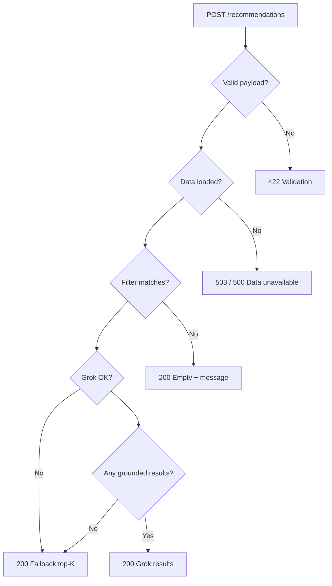

# Edge Cases: AI-Powered Restaurant Recommendation System

This document catalogs **edge cases** identified from [Architecture.md](./Architecture.md). Each item maps to an architectural component, describes the failure or anomaly, and specifies expected system behavior.

**Legend — severity**

| Level | Meaning |
|-------|---------|
| **High** | Can break core flow, leak bad data, or harm UX/security |
| **Medium** | Degraded experience or incorrect subset of results |
| **Low** | Cosmetic, rare, or easily recovered |

---

## Summary by Layer

| Layer | Edge case count | Critical themes |
|-------|-----------------|-----------------|
| Data ingestion & storage | 12 | Missing file, dirty schema, HF outage |
| Filtering & candidates | 14 | Zero matches, over-constrained prefs, cap bias |
| API & validation | 11 | Invalid payloads, boundary `top_k` |
| Grok / xAI integration | 13 | Timeouts, rate limits, malformed JSON |
| Grounding & parser | 10 | Hallucinated names, fuzzy mismatch |
| Recommendation service | 6 | Pipeline ordering, partial failures |
| Frontend | 10 | CORS, wrong API URL, stale state |
| Security & abuse | 7 | Oversized input, API key exposure |
| Deployment & ops | 8 | Missing env, cold start, data drift |
| Cross-cutting | 5 | Performance, concurrency |

---

## 1. Data Ingestion & Storage

*Architecture refs: §8.1 Ingestion pipeline, §8.2 Schema, §8.3 Runtime access*

| ID | Edge case | Severity | Expected behavior |
|----|-----------|----------|-------------------|
| D-01 | **Processed parquet missing** (`data/processed/restaurants.parquet` not found) | High | Backend fails fast on startup or first request with clear error; `/health` may report `data_ready: false`; do not call Grok |
| D-02 | **Hugging Face download fails** (network, auth, dataset renamed) | High | Ingestion script exits non-zero; document manual retry; API uses last successful parquet if present |
| D-03 | **Empty dataset after preprocess** (all rows dropped) | High | Block recommendation path; return 503 or maintenance message |
| D-04 | **Missing critical columns** post-ingest (`name`, `location`, `rating`) | High | Ingestion validation fails; do not deploy new parquet |
| D-05 | **Invalid rating formats** (`"NEW"`, `"-"`, `"4.1/5"`, null) | Medium | Normalize to float or drop row at ingest; filter must not compare strings to floats |
| D-06 | **Duplicate restaurant names** in same city | Medium | Grounding uses name + address (or index); Grok may conflate duplicates—prefer stable `id` in candidates |
| D-07 | **Inconsistent location strings** (`"Bengaluru"` vs `"Bangalore"`, extra spaces, casing) | Medium | Normalize at ingest (trim, lowercase, alias map); filter uses normalized form |
| D-08 | **Multi-cuisine strings** (`"Italian, Chinese, Fast Food"`) | Low | Substring cuisine filter may over-match; document partial-match behavior |
| D-09 | **Cost field non-numeric** (`"₹1,200"`, `"$$$"`, empty) | Medium | Parse or bucket as `unknown`; exclude from strict budget filter or map to nearest bucket |
| D-10 | **Budget bucket boundaries** (user `medium` but cost at quantile edge) | Low | Document thresholds; edge restaurants may flip bucket after re-ingest |
| D-11 | **Stale parquet** (dataset updated on HF, local file old) | Medium | Version metadata in parquet or `meta.dataset_version`; optional refresh job |
| D-12 | **Large parquet / memory pressure** on load | Medium | Lazy singleton load once; monitor RAM; consider chunked read if dataset grows |

---

## 2. Filtering & Candidate Cap

*Architecture refs: §7 Request flow, §11 Integration layer, principle **Filter before AI***

| ID | Edge case | Severity | Expected behavior |
|----|-----------|----------|-------------------|
| F-01 | **Zero restaurants after all filters** | High | Return `200` with empty `recommendations` and user message (suggest relaxing location, cuisine, rating, or budget); **do not** call Grok |
| F-02 | **Unknown location** (not in dataset) | Medium | Return empty or `422` with hints from `GET /metadata/locations` |
| F-03 | **Location typo** (`"Banglore"`) | Medium | Optional fuzzy location match or suggestions; otherwise empty result with hint |
| F-04 | **Over-constrained preferences** (e.g. 5.0 rating + low budget + rare cuisine in small city) | Medium | Same as F-01; message explains which filters are tightest |
| F-05 | **Only one candidate after filter** | Medium | Skip Grok or still call with `top_k=1`; cap prompt size; grounding trivial |
| F-06 | **Candidates fewer than `top_k`** | Medium | Return fewer than `top_k` items; UI shows actual count |
| F-07 | **Candidates greater than cap (20–30)** but user wants `top_k=5`** | Low | Pre-LLM sort then cap N; Grok ranks within N only—high-rated venues outside cap never reach Grok |
| F-08 | **Cuisine substring false positives** (`"atin"` matches `"Latin"`) | Low | Token-boundary or comma-split match preferred |
| F-09 | **`min_rating` above dataset max** in that city | Medium | Empty result (F-01) |
| F-10 | **`min_rating` = 0 or negative** (if validation bypassed) | Medium | Backend rejects with `422` (bound [0, 5]) |
| F-11 | **Budget filter excludes all** in location+cuisine slice | Medium | Empty result with hint to try adjacent budget |
| F-12 | **Case-sensitive location mismatch** | Low | Case-insensitive filter per architecture |
| F-13 | **`extra_preferences` not used in structured filter** | Low | Only passed to Grok prompt; user may expect filtering—document limitation |
| F-14 | **Ties on rating/votes** in pre-LLM sort | Low | Deterministic secondary sort (votes desc, then name) |

---

## 3. API & Validation

*Architecture refs: §9 API Design, §6.1 `schemas`, `preferences`*

| ID | Edge case | Severity | Expected behavior |
|----|-----------|----------|-------------------|
| A-01 | **Missing required fields** (`location`, `budget`, `cuisine`) | Medium | `422` with per-field errors |
| A-02 | **Invalid `budget` enum** (`"cheap"`, `""`) | Medium | `422`; only `low`, `medium`, `high` |
| A-03 | **`min_rating` > 5 or non-numeric** | Medium | `422` |
| A-04 | **`top_k` = 0 or negative** | Medium | `422` or clamp to 1 with warning in `meta` |
| A-05 | **`top_k` very large** (e.g. 1000) | Medium | Clamp to server max (e.g. 20) to protect Grok cost and response size |
| A-06 | **Empty strings** for `location` / `cuisine` (whitespace only) | Medium | `422` after trim |
| A-07 | **Extremely long `extra_preferences`** (prompt injection / token blowup) | High | Max length cap (e.g. 500 chars); `422` if exceeded |
| A-08 | **Malformed JSON body** | Medium | `422` / `400` from FastAPI |
| A-09 | **Wrong `Content-Type`** | Low | Reject non-JSON POST |
| A-10 | **`GET /metadata/*` with empty dataset** | Low | Return `[]` |
| A-11 | **Concurrent duplicate POSTs** | Low | Stateless handling; no shared mutable request state |

---

## 4. Grok / xAI Integration

*Architecture refs: §10 Grok Integration, §7 sequence (Grok Client → xAI)*

| ID | Edge case | Severity | Expected behavior |
|----|-----------|----------|-------------------|
| G-01 | **`XAI_API_KEY` missing or invalid** | High | Fallback to rule-based top-K (`meta.source: "fallback"`); log auth error; never expose key to client |
| G-02 | **xAI API timeout** | High | Retry with backoff (limited); then fallback |
| G-03 | **Rate limit (429)** | High | Backoff + retry; then fallback; optional `Retry-After` respect |
| G-04 | **xAI service down (5xx)** | High | Fallback; optional `503` only if fallback disabled |
| G-05 | **Invalid `GROK_MODEL` name** | High | Log error; fallback or fail startup config check |
| G-06 | **Response not JSON** (markdown prose, code fences) | High | Parser strips fences / extracts JSON; retry once with stricter prompt; else fallback |
| G-07 | **Truncated JSON** (token limit hit) | High | Parser partial recovery or fallback |
| G-08 | **Empty Grok content** | Medium | Fallback |
| G-09 | **Grok returns fewer than `top_k` items** | Medium | Return what Grok gave; backfill from sorted candidates if needed |
| G-10 | **Grok returns more than `top_k` items** | Low | Truncate to `top_k` after grounding |
| G-11 | **Very large prompt** (30 wide rows + long `extra_preferences`) | Medium | Enforce candidate cap and field truncation in prompt builder |
| G-12 | **Latency > 30s** | Medium | Request timeout; frontend shows timeout message; fallback if configured |
| G-13 | **Model policy / safety refusal** | Medium | Fallback with template explanation |

---

## 5. Grounding & Parser

*Architecture refs: §10 Grounding, §2 principle **Grounded recommendations***

| ID | Edge case | Severity | Expected behavior |
|----|-----------|----------|-------------------|
| R-01 | **Hallucinated restaurant name** (not in candidate list) | High | Drop recommendation; log grounding failure |
| R-02 | **Near-duplicate name** (`"Barbeque Nation"` vs `"Barbeque Nation - Indiranagar"`) | Medium | Fuzzy match threshold; prefer exact then address |
| R-03 | **Grok swaps rating/cost** vs dataset | Medium | Backfill `rating` and `estimated_cost` from dataset row |
| R-04 | **Duplicate same restaurant in Grok output** | Medium | Deduplicate by grounded id |
| R-05 | **Missing `explanation` field** | Medium | Template explanation from preferences + row data |
| R-06 | **Missing `summary`** | Low | Omit `SummaryBlock` in UI |
| R-07 | **Invalid JSON types** (`rating: "four"`) | Medium | Coerce or backfill from dataset |
| R-08 | **All Grok recommendations dropped by grounding** | High | Fallback top-K from filtered candidates |
| R-09 | **Partial grounding** (3 of 5 valid) | Medium | Return 3; optionally backfill to `top_k` from candidates |
| R-10 | **Encoding issues in names** (unicode, special chars) | Low | UTF-8 throughout; normalize for match |

---

## 6. Recommendation Service (Orchestration)

*Architecture refs: §6.1 `recommendation_service`, §7 Request flow*

| ID | Edge case | Severity | Expected behavior |
|----|-----------|----------|-------------------|
| S-01 | **Filter skipped due to bug** (Grok called on full dataset) | High | Architecture violation—integration test must assert filter-before-Grok |
| S-02 | **Exception mid-pipeline after filter** | Medium | Do not return ungrounded partial Grok output; return 500 or fallback |
| S-03 | **Lazy dataset load race** (first two requests parallel) | Low | Thread-safe singleton for DataFrame load |
| S-04 | **`/health` OK but data not loaded** | Medium | Health check includes `data_ready` flag |
| S-05 | **Fallback + Grok both partially applied** | Medium | Single `meta.source`; no duplicate lists |
| S-06 | **`candidate_count` in meta wrong** | Low | Set from actual filtered count before cap |

---

## 7. Frontend

*Architecture refs: §12 Frontend Architecture*

| ID | Edge case | Severity | Expected behavior |
|----|-----------|----------|-------------------|
| U-01 | **`NEXT_PUBLIC_API_URL` unset or wrong** | High | Clear error in UI; failed fetch to wrong host |
| U-02 | **Backend down** (connection refused) | High | Network error banner; retry CTA |
| U-03 | **CORS blocked** (origin not in `CORS_ORIGINS`) | High | Browser console error; document prod origin in env |
| U-04 | **`422` validation errors** | Medium | Map field errors to form inputs |
| U-05 | **Empty recommendations (F-01)** | Medium | Dedicated empty state; suggestions to relax filters |
| U-06 | **Double form submit** | Low | Disable submit while loading |
| U-07 | **Stale results after new search** | Low | Clear list when new request starts |
| U-08 | **Partial response fields null** | Medium | UI placeholders for missing rating/cost |
| U-09 | **Very long explanation text** | Low | Truncate or scroll in card layout |
| U-10 | **SSR vs client env** (Next.js) | Medium | `NEXT_PUBLIC_*` only available at build; document rebuild on URL change |

---

## 8. Security & Abuse

*Architecture refs: §13 Security & Trust Boundaries*

| ID | Edge case | Severity | Expected behavior |
|----|-----------|----------|-------------------|
| SEC-01 | **API key in frontend bundle** | High | Never use `NEXT_PUBLIC_` for `XAI_API_KEY` |
| SEC-02 | **Prompt injection via `extra_preferences`** | Medium | Sanitize length; system prompt instructs ignore override of candidate list |
| SEC-03 | **Unauthenticated spam to `/recommendations`** | Medium | Rate limit per IP in production; Grok cost exposure |
| SEC-04 | **CORS `*` in production** | Medium | Restrict to known frontend origin |
| SEC-05 | **Logging PII** (full free-text preferences) | Medium | Log hashes or redacted snippets per §10 observability |
| SEC-06 | **Oversized POST body** | Medium | Body size limit at reverse proxy / FastAPI |
| SEC-07 | **Malicious JSON depth** | Low | Standard parser limits |

---

## 9. Deployment & Operations

*Architecture refs: §14 Deployment View*

| ID | Edge case | Severity | Expected behavior |
|----|-----------|----------|-------------------|
| O-01 | **Backend scaled without parquet in image** | High | Mount `DATA_PATH` or bake data in CI |
| O-02 | **Frontend on HTTPS, backend HTTP only** | Medium | Mixed content blocked—terminate TLS at API or use HTTPS API URL |
| O-03 | **Wrong `CORS_ORIGINS` after deploy** | High | Update env when frontend domain changes |
| O-04 | **Secret rotation** (`XAI_API_KEY`) | Medium | Rolling restart backend; no downtime if dual-key supported |
| O-05 | **Cold start + first Grok call slow** | Low | Frontend loading state > default spinner timeout |
| O-06 | **Multi-worker Uvicorn duplicate memory** | Low | Each worker loads parquet—size instances accordingly |
| O-07 | **`/health` probed but recommendations untested** | Low | Synthetic check optional on staging |
| O-08 | **Dataset locale / currency mismatch** | Low | Display as-is from dataset; i18n out of MVP (§15) |

---

## 10. Cross-Cutting & Performance

*Architecture refs: §15 Cross-Cutting Concerns*

| ID | Edge case | Severity | Expected behavior |
|----|-----------|----------|-------------------|
| X-01 | **Filter fast, Grok slow** | Medium | Frontend timeout > backend Grok timeout; show partial message |
| X-02 | **Token cost spike** (many users, large N cap) | Medium | Enforce candidate cap and `top_k` max |
| X-03 | **Tests mock Grok but prod differs** | Low | Contract test on parser with real-shaped fixtures |
| X-04 | **Schema drift** (API response vs frontend types) | Medium | Shared OpenAPI or generated types |
| X-05 | **i18n not supported** (non-English `extra_preferences`) | Low | Grok may still respond; no guaranteed language |

---

## Decision Matrix: Empty vs Error vs Fallback

---

## Test Priority (from edge cases)

Implement tests in this order:

1. **F-01, G-01, R-01, R-08, D-01** — empty filter, no key, hallucination, full grounding drop, missing data  
2. **A-01, A-05, A-07, G-06, G-02** — validation, caps, malformed Grok JSON, timeout  
3. **F-06, R-03, G-09** — fewer than `top_k`, field backfill  
4. **U-02, U-05, SEC-01** — frontend errors and secret boundary  

---

## Related Documents

- [Architecture](./Architecture.md) — source system design  
- [Implementation Plan](./implementation.md) — where to add handlers per phase  
- [Problem Statement](./problem%20statement.md) — success criteria
