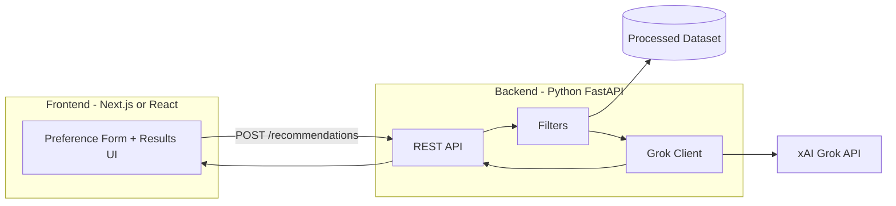
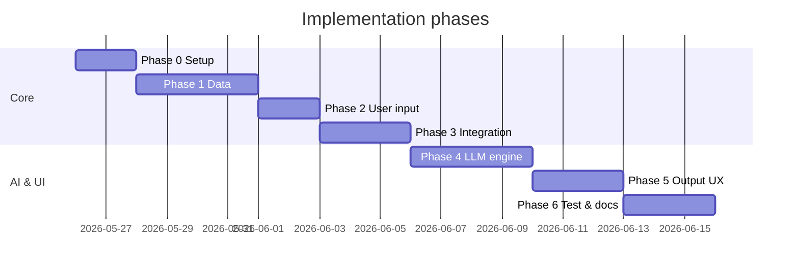

# Implementation Plan: AI-Powered Restaurant Recommendation System

This document defines a **phase-wise implementation plan** derived from [problem statement.md](./problem%20statement.md). Each phase maps to a workflow step, lists concrete tasks, deliverables, and acceptance criteria.

---

## Overview

| Phase | Name | Maps to problem statement |
|-------|------|-----------------------------|
| 0 | Project setup & foundations | Prerequisites for all phases |
| 1 | Data ingestion & preprocessing | § System Workflow — Data Ingestion |
| 2 | User input & preference model | § System Workflow — User Input |
| 3 | Integration layer (filter + prompt) | § System Workflow — Integration Layer |
| 4 | LLM recommendation engine | § System Workflow — Recommendation Engine |
| 5 | Output display & UX | § System Workflow — Output Display |
| 6 | Testing, hardening & documentation | Success criteria & production readiness |

## Technology Stack

| Layer | Choice | Notes |
|-------|--------|--------|
| **LLM** | **Groq** | Chat completions via [Groq API](https://console.groq.com/) (OpenAI-compatible client) |
| **Backend** | **Python 3.10+** | FastAPI REST API: ingestion, filters, Groq orchestration |
| **Frontend** | **Next.js** (preferred) or **React** | Next.js App Router recommended; plain React + Vite acceptable if you skip SSR |
| **Data** | `datasets`, `pandas` | Hugging Face Zomato dataset |
| **Config** | `.env` per app | `backend/.env`, `frontend/.env.local` |

**Architecture (target):**



**Groq integration (backend):**

- Env: `GROQ_API_KEY`, `GROQ_MODEL` (e.g. `llama-3.3-70b-versatile` or current model from Groq docs)
- Use `openai` Python SDK with `base_url="https://api.groq.com/openai/v1"`
- Keep API keys **only** on the backend; never expose `GROQ_API_KEY` to the browser

**Frontend choice:**

- **Next.js** — recommended: file-based routing, `app/` pages, easy env for `NEXT_PUBLIC_API_URL`, production-ready
- **React (Vite/CRA)** — same UI components; call backend via `fetch`/`axios` to `http://localhost:8000`

---

## Phase 0: Project Setup & Foundations

**Goal:** Establish repository structure, dependencies, and configuration so later phases can be built incrementally.

### Tasks

1. Create **monorepo** layout:
   ```
   ├── backend/
   │   ├── src/
   │   │   ├── ingestion/
   │   │   ├── filters/
   │   │   ├── llm/              # Grok prompts + client
   │   │   ├── models/
   │   │   └── api/              # FastAPI routes
   │   ├── tests/
   │   ├── requirements.txt
   │   └── .env.example
   ├── frontend/
   │   ├── app/                  # Next.js App Router (or src/ for React)
   │   ├── components/
   │   ├── package.json
   │   └── .env.local.example
   ├── data/                     # processed dataset (gitignored if large)
   ├── docs/
   └── README.md
   ```
2. **Backend:** `requirements.txt` — `fastapi`, `uvicorn`, `datasets`, `pandas`, `pydantic`, `python-dotenv`, `openai` (xAI-compatible), `httpx`.
3. **Frontend:** scaffold with `create-next-app` (TypeScript + App Router) **or** `npm create vite@latest` for React.
4. Add root `.gitignore`: `.env`, `backend/.env`, `frontend/.env.local`, `node_modules/`, `data/raw/`, `__pycache__/`, `.next/`.
5. Document in `README.md`: run backend on `:8000`, frontend on `:3000`, CORS for local dev.

### Deliverables

- FastAPI app stub: `GET /health`, `POST /recommendations` (501 until Phase 4)
- Next.js/React home page stub calling `/health`
- `backend/.env.example`: `GROQ_API_KEY`, `GROQ_MODEL`, `CORS_ORIGINS=http://localhost:3000`
- `frontend/.env.local.example`: `NEXT_PUBLIC_API_URL=http://localhost:8000`

### Acceptance criteria

- `pip install -r backend/requirements.txt` and `uvicorn` start succeed
- `npm install` + `npm run dev` in `frontend/` serves the UI
- Frontend can reach backend `/health` with CORS enabled

### Dependencies

- None (first phase)

---

## Phase 1: Data Ingestion & Preprocessing

**Goal:** Load the Zomato dataset from Hugging Face and produce a clean, queryable table of restaurants.

**Reference:** [ManikaSaini/zomato-restaurant-recommendation](https://huggingface.co/datasets/ManikaSaini/zomato-restaurant-recommendation)

### Tasks

1. **Load dataset**
   - Use `datasets.load_dataset("ManikaSaini/zomato-restaurant-recommendation")`.
   - Inspect schema (column names, dtypes, missing values).
2. **Select & rename fields** (align names to internal schema):
   - `name` — restaurant name
   - `location` / `city` — geographic filter
   - `cuisines` — string or list; normalize to searchable form
   - `cost` / `approx_cost_for_two` — numeric or bucketed budget
   - `rating` — numeric; handle `/5` or aggregate score formats
   - Optional: `votes`, `address`, `rest_type`, `online_order`, etc.
3. **Clean data**
   - Drop or impute rows with missing critical fields (name, location, rating).
   - Parse ratings to float; clamp or flag invalid values.
   - Normalize location/city strings (case, trim, alias map if needed).
   - Split or tokenize multi-cuisine strings (e.g. `"Italian, Chinese"`).
4. **Budget buckets**
   - Map cost to `low` / `medium` / `high` using dataset quantiles or documented thresholds.
5. **Persist processed data**
   - Save to `data/processed/restaurants.parquet` or `.csv` for fast reload.
   - Add a one-shot script: `python -m backend.src.ingestion.prepare_data` (or documented equivalent from `backend/`).

### Deliverables

- `backend/src/ingestion/load_dataset.py` — HF load + DataFrame export
- `backend/src/ingestion/preprocess.py` — cleaning + schema normalization
- Processed artifact under `data/processed/`
- Short notebook or script log of row counts before/after cleaning

### Acceptance criteria

- Processed file loads in &lt; few seconds for typical dev hardware
- Required columns exist with consistent dtypes
- Sample query: restaurants in `"Bangalore"` with rating ≥ 4.0 returns non-empty results when data exists

### Dependencies

- Phase 0 complete

---

## Phase 2: User Input & Preference Model

**Goal:** Define how preferences are collected, validated, and represented for downstream filtering and LLM prompts.

### Tasks

1. **Define `UserPreferences` model** (dataclass or Pydantic):
   - `location: str` (required)
   - `budget: Literal["low", "medium", "high"]` (required)
   - `cuisine: str` (required; partial match OK)
   - `min_rating: float` (default e.g. 3.5)
   - `extra_preferences: str | list[str]` (optional; free text or tags)
   - `top_k: int` (default 5; how many recommendations to show)
2. **API contract** (backend Pydantic models mirror preferences):
   - `POST /recommendations` request body: location, budget, cuisine, min_rating, extra_preferences, top_k.
   - `GET /metadata/locations` and `GET /metadata/cuisines` (implemented) for frontend searchable autocompletes.
3. **Frontend form** (Next.js/React):
   - Controlled inputs for all preference fields from the problem statement.
   - Searchable autocomplete comboboxes for locations and cuisines.
   - Client-side validation before submit; display API validation errors.
4. **Validation** (backend — source of truth)
   - Reject empty location/cuisine; bound `min_rating` to [0, 5].
   - Normalize budget enum; suggest close-match cities using `difflib.get_close_matches` if location is unrecognized.
   - Serialize for logging/debug.

### Deliverables

- `backend/src/models/preferences.py` — `UserPreferences` + validators
- `backend/src/api/schemas.py` — request/response DTOs for FastAPI
- `backend/src/api/routes/metadata.py` — locations and cuisines metadata router
- `frontend/components/PreferenceForm.tsx` — submits to backend API with searchable dropdown autocomplete logic


### Acceptance criteria

- Invalid API payloads return `422` with clear field errors
- Frontend form submits valid JSON and receives structured error responses
- Extra preferences are preserved as a string for Groq (Phase 4)

### Dependencies

- Phase 1 (need valid locations/cuisines for validation hints)

---

## Phase 3: Integration Layer (Filter + Prompt)

**Goal:** Filter restaurants by structured preferences, then format a bounded candidate set for the LLM.

### Tasks

1. **Structured filter pipeline** (`backend/src/filters/restaurant_filter.py`):
   - Filter by `location` (case-insensitive match on city/location column).
   - Filter by `min_rating`.
   - Filter by `cuisine` (substring or token match in cuisines field).
   - Filter by `budget` bucket (from Phase 1 mapping).
2. **Ranking pre-LLM (optional but recommended)**
   - Sort filtered results by rating (desc), then votes/popularity if available.
   - Cap candidates sent to LLM (e.g. top 20–30) to control token cost and latency.
3. **Prompt template design** (`backend/src/llm/prompts.py`) — tuned for Groq:
   - System message: role (food recommendation assistant), rules (only use provided restaurants, no invented venues).
   - User message: JSON or markdown table of candidates + full `UserPreferences`.
   - Instructions: rank top N, explain each pick, optional one-paragraph summary.
4. **Response contract**
   - Ask LLM for structured JSON when possible:
     ```json
     {
       "summary": "...",
       "recommendations": [
         {
           "restaurant_name": "...",
           "cuisine": "...",
           "rating": 4.5,
           "estimated_cost": "...",
           "explanation": "..."
         }
       ]
     }
     ```
   - Include restaurant identifiers from dataset (name + address or index) to reduce hallucination.

### Deliverables

- `backend/src/filters/restaurant_filter.py`
- `backend/src/llm/prompts.py` with versioned template constants (Groq system/user messages)
- `backend/src/services/recommendation_service.py` — orchestrates filter → prompt build
- Unit tests: filter returns subset respecting all constraints

### Acceptance criteria

- Filters run **before** any LLM call (per success criteria in problem statement)
- Empty filter result returns user-friendly message (“no matches”; suggest relaxing criteria)
- Prompt includes only candidate rows from the dataset, not the full 50k+ table

### Dependencies

- Phases 1 and 2

---

## Phase 4: Groq Recommendation Engine

**Goal:** Call **Groq** with the prepared prompt, parse the response, and merge AI output with ground-truth dataset fields.

### Tasks

1. **Groq client wrapper** (`backend/src/llm/grok_client.py`):
   - Read `GROQ_API_KEY` and `GROQ_MODEL` from environment.
   - Use OpenAI-compatible client: `OpenAI(api_key=..., base_url="https://api.groq.com/openai/v1")` and `chat.completions.create`.
   - Implement `get_recommendations(preferences, candidates) -> RecommendationResult`.
   - Handle timeouts, rate limits, and retries with backoff.
   - Request JSON-shaped output where supported (system prompt + `response_format` if model supports it).
2. **Wire FastAPI** (`backend/src/api/routes/recommendations.py`):
   - `POST /recommendations` runs full pipeline: validate → filter → Groq → grounded response.
3. **Grounding & validation**
   - Match LLM `restaurant_name` to filtered candidates (fuzzy match if needed).
   - Drop or flag recommendations not in the candidate list.
   - Fill `rating` and `estimated_cost` from dataset when LLM omits or drifts.
4. **Fallback behavior**
   - If Groq fails or `GROQ_API_KEY` is unset: return top-K by structured sort with template explanations (“High rating in your budget range”).
5. **Logging**
   - Log prompt hash, token usage (Groq response metadata), and latency (no PII in logs).

### Deliverables

- `backend/src/llm/grok_client.py`
- `backend/src/llm/parser.py` — JSON parse + validation
- `backend/src/models/recommendation.py` — result types
- `backend/src/api/routes/recommendations.py` — live endpoint
- Integration test with mocked Groq response

### Acceptance criteria

- Every displayed recommendation maps to a row in the filtered candidate set
- Each item includes a non-empty `explanation`
- Optional `summary` field populated when Groq succeeds
- `POST /recommendations` returns JSON the frontend can render without transformation
- System remains usable when API key is missing (fallback path documented)

### Dependencies

- Phase 3

---

## Phase 5: Frontend UI & Output Display

**Goal:** Present top recommendations in a clear, user-friendly **Next.js or React** interface.

### Tasks

1. **Results UI** (`frontend/components/RecommendationList.tsx`):
   - Card or table layout: Name, Cuisine, Rating, Estimated Cost, AI explanation.
   - Show Groq `summary` at the top when present.
   - Loading state and error banners (network, 422, 503, empty matches).
2. **Pages / routing**
   - **Next.js:** `app/page.tsx` — form + results on home or `/recommend` route.
   - **React:** single-page flow with same components in `App.tsx`.
3. **API integration** (`frontend/lib/api.ts`):
   - `getRecommendations(preferences)` → `POST ${NEXT_PUBLIC_API_URL}/recommendations`.
   - TypeScript types aligned with backend response schema.
4. **UX polish**
   - Responsive layout, accessible labels, budget/rating controls.
   - Optional: export last response as JSON download from the browser.
5. **Local dev workflow**
   - Terminal 1: `uvicorn backend.src.api.main:app --reload --port 8000`
   - Terminal 2: `cd frontend && npm run dev`

### Deliverables

- End-to-end flow: form submit → FastAPI → Groq → rendered cards
- `frontend/components/PreferenceForm.tsx`, `RecommendationList.tsx`, `SummaryBlock.tsx`
- Screenshot or GIF in `docs/` for README (optional)

### Acceptance criteria

- User sees exactly `top_k` recommendations (or fewer if data sparse)
- All five output fields from the problem statement are visible in the UI
- Full round-trip completes in acceptable time (&lt; ~30s including Groq for typical N)
- No Groq secrets in frontend bundle or browser network tab

### Dependencies

- Phases 2, 3, 4

---

## Phase 6: Testing, Hardening & Documentation

**Goal:** Meet success criteria from the problem statement and make the project maintainable.

### Tasks

1. **Tests**
   - Backend: preprocessing, filters, Groq prompt building, response parser (mock Groq).
   - Integration: `POST /recommendations` with fixture data and mocked Groq.
   - Frontend (optional): component tests for form validation and result rendering.
2. **Edge cases**
   - Unknown city, impossible rating+cuisine combo, single-row dataset slice.
   - LLM returns malformed JSON → parser recovery.
3. **Documentation**
   - Update `README.md`: architecture diagram, env setup, example run.
   - Link `docs/problem statement.md` and this file.
4. **Quality**
   - Lint/format (`ruff` or `black` + `isort` optional).
   - `requirements.txt` version pins for reproducibility.

### Deliverables

- `tests/` with pytest suite and CI-ready command: `pytest`
- Updated README and env example
- Checklist mapping to [success criteria](./problem%20statement.md#success-criteria)

### Acceptance criteria

| Success criterion (problem statement) | Verification |
|--------------------------------------|--------------|
| Grounded in real dataset records | Parser rejects unknown restaurants; tests assert match |
| Filters before LLM reasoning | Integration test asserts filter called first |
| Personalized explanations | Manual or snapshot test on explanation field |
| Readable, actionable output | UX review on Next.js/React UI |

### Dependencies

- Phases 1–5 complete

---

## Phase Timeline (Suggested)



Adjust durations to your schedule; Phases 3–4 are the critical path.

---

## Implementation Order Summary

1. **Phase 0** — scaffold repo  
2. **Phase 1** — data pipeline (unblocks everything)  
3. **Phase 2** — preferences (can parallelize lightly with Phase 1 tail)  
4. **Phase 3** — filters + prompts (must precede LLM)  
5. **Phase 4** — LLM + grounding  
6. **Phase 5** — Next.js/React UI polish  
7. **Phase 6** — tests and docs  

---

## Quick Start Checklist (Per Phase)

- [x] **Phase 0:** Layout, deps, `.env.example`, README setup steps  
- [x] **Phase 1:** Ingestion code + `python -m src.ingestion.prepare_data` (run locally for parquet)  
- [x] **Phase 2:** `UserPreferences` validated via API + frontend form  
- [x] **Phase 3:** Filters + prompt template; candidate cap enforced  
- [x] **Phase 4:** Groq returns parsed, grounded recommendations via `POST /recommendations`  


- [x] **Phase 5:** Next.js/React UI shows 5 fields per restaurant  
- [x] **Phase 6:** Tests pass; success criteria checklist signed off  

---

## Related Documents

- [Problem Statement](./problem%20statement.md) — requirements and workflow  
- [Architecture](./Architecture.md) — system design, components, APIs, data flow
- [Edge Cases](./edgecase.md) — failure modes and expected behaviors
- [README](../README.md) — project entry point (update as phases complete)
