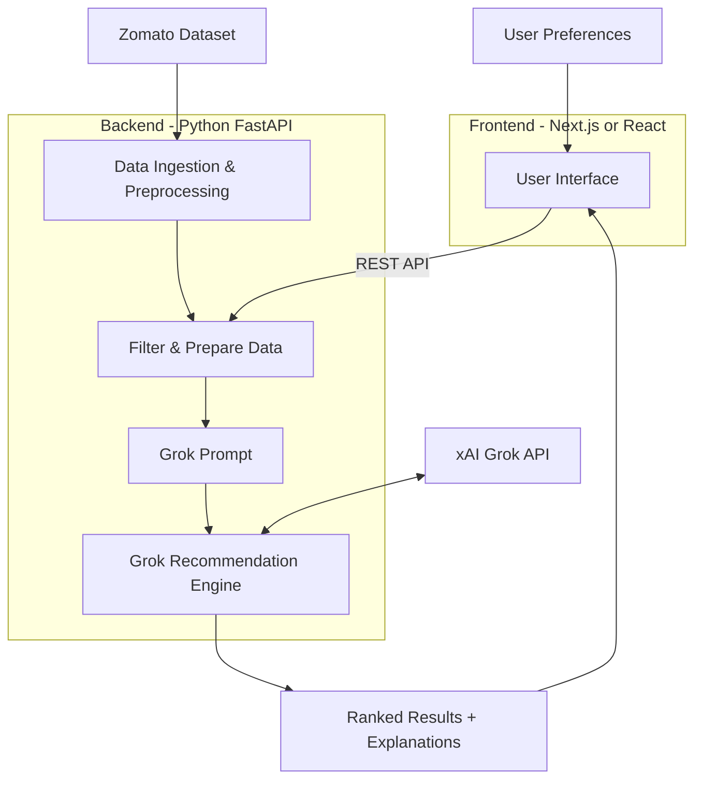

# Problem Statement: AI-Powered Restaurant Recommendation System (Zomato Use Case)

You are tasked with building an AI-powered restaurant recommendation service inspired by Zomato. The system should intelligently suggest restaurants based on user preferences by combining structured data with a Large Language Model (LLM).

## Objective

Design and implement an application that:

- Takes user preferences (such as location, budget, cuisine, and ratings)
- Uses a real-world dataset of restaurants
- Leverages an LLM to generate personalized, human-like recommendations
- Displays clear and useful results to the user

## Technology Stack

| Component | Technology |
|-----------|------------|
| LLM | **Grok (xAI)** — personalized ranking and explanations |
| Backend | **Python** (FastAPI) — data pipeline, filtering, Grok integration |
| Frontend | **Next.js** (preferred) or **React** — preference form and recommendation UI |
| Dataset | [Zomato on Hugging Face](https://huggingface.co/datasets/ManikaSaini/zomato-restaurant-recommendation) |

The frontend calls the Python API; the backend holds the xAI API key and talks to Grok. User filters are applied in Python before any Grok request.

## System Workflow

### 1. Data Ingestion

- Load and preprocess the Zomato dataset from Hugging Face: [ManikaSaini/zomato-restaurant-recommendation](https://huggingface.co/datasets/ManikaSaini/zomato-restaurant-recommendation)
- Extract relevant fields such as restaurant name, location, cuisine, cost, rating, etc.

### 2. User Input

Collect user preferences:

| Preference | Examples |
|------------|----------|
| Location | Delhi, Bangalore |
| Budget | low, medium, high |
| Cuisine | Italian, Chinese |
| Minimum rating | User-defined threshold |
| Additional preferences | family-friendly, quick service |

### 3. Integration Layer

- Filter and prepare relevant restaurant data based on user input
- Pass structured results into a Grok prompt
- Design a prompt that helps Grok reason and rank options

### 4. Recommendation Engine (Grok)

Use **Grok** to:

- Rank restaurants
- Provide explanations (why each recommendation fits)
- Optionally summarize choices

### 5. Output Display

Present top recommendations in a user-friendly format:

| Field | Description |
|-------|-------------|
| Restaurant Name | Name of the recommended venue |
| Cuisine | Type(s) of cuisine offered |
| Rating | User or aggregate rating |
| Estimated Cost | Cost for two or similar metric |
| AI-generated explanation | Why this restaurant matches the user's preferences |

## High-Level Architecture

## Related Documents

- [Architecture](./Architecture.md) — detailed system design
- [Implementation plan](./implementation.md) — phase-wise build guide

## Success Criteria

- Recommendations are grounded in real dataset records (not hallucinated venues)
- User filters (location, budget, cuisine, rating) are applied before LLM reasoning
- Each top recommendation includes a clear, personalized explanation
- Output is readable and actionable for end users
